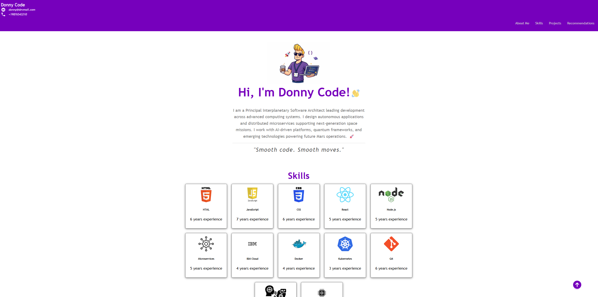

# Donny Code Portfolio

This project was built as part of a course. Most of the code is based on instructional material and may be subject to the course provider’s terms.

A personal portfolio project showcasing HTML, CSS, and JavaScript skills.

## 🌐 Live Demo

👉 https://donwilson-dev.github.io/donny-code/

## 🚀 Features

- Responsive layout
- Styled with CSS
- Interactive elements using JavaScript
- Animated UI elements

## 🛠️ Technologies Used

- HTML
- CSS
- JavaScript

## 📸 Preview

## 👨‍💻 Author

Don Wilson
